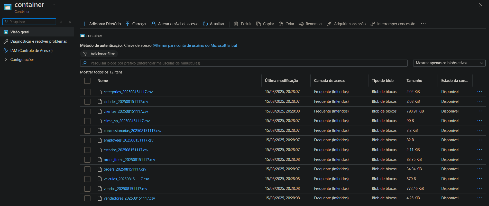
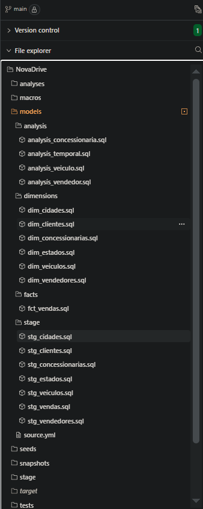
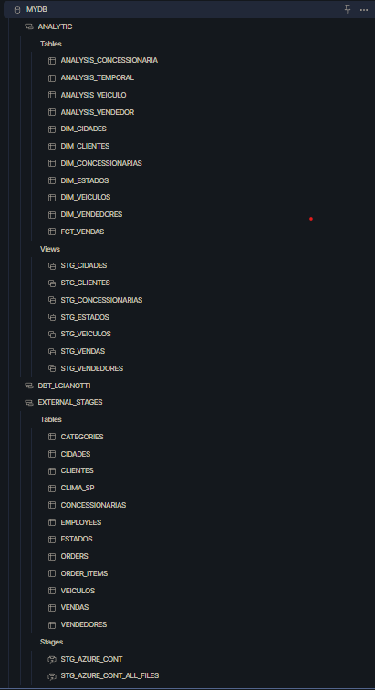

# Datapipe Process 

This is a process to show how I would develop a robust and automated datapipe process using Azure Data Factory to ingest and orchestrate data, Snowflake as my datawarehouse, DBT to transform the data, and Looker to visualize que results.

##

The main ideia of this project is to present a well documented datapipeline, following best pratices, ensuring governance over the process and good replicability as well. 

##
## Azure

Using the .csv example files I found in a Udemy Course, I created a Storage Account and a Container (showed in the image bellow) to store all the raw datasources. After this setup, it was also necessary to set the permissions in snowflake to configure the connection between both tools, allowing the ingesting of raw data into my datawarehouse of choice, snowflake in this case.

##
## DBT

All the data transformations that made sense, and that in this example, would`ve been requested by the users, were done setting dim, fact and analytical tables and folders in DBT.

##
## Snowflake

Besides the connection to Azure and the table storage (with all tables being created in DBT), there`s no major process being done in Snowflake.

  
##
## Looker

Here`s the dashboard developed using one of the analytical tables, in Looker.

